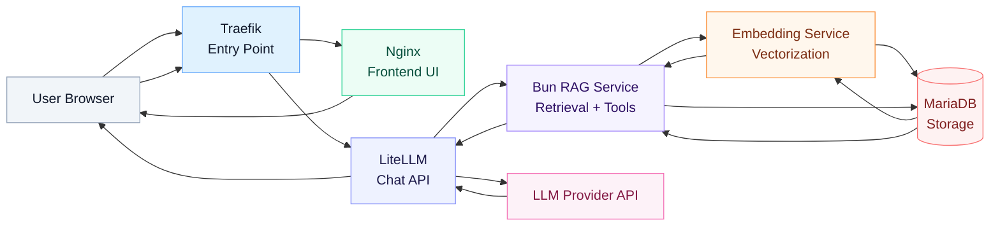
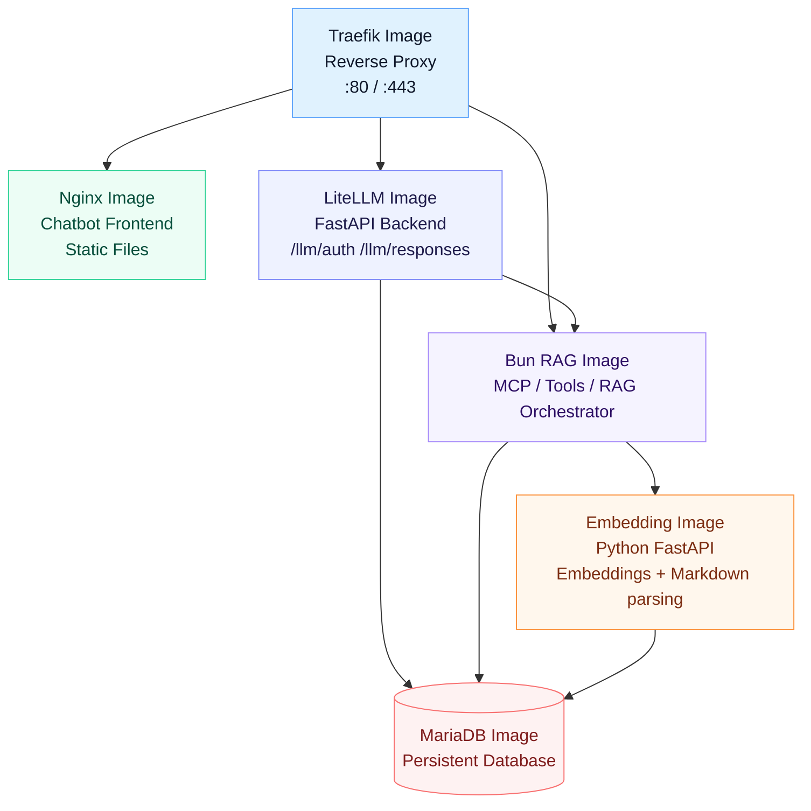

# RAG System

## Architecture Diagrams

### Dataflow Diagram


### Docker Image Stack


## Docker Overview

This system is a fully containerized custom Retrieval-Augmented Generation (RAG) stack exposed via MCP and REST API with focus on Document managment and rich metadata to enable better citations. System includes its own lite embedding endpoint that can run on CPU.

| Image | Purpose |
|----------|---------|
| traefik | Routes all incoming traffic to the correct service (UI, API, MCP). Acts as the system gateway. |
| nginx | Serves the web-based user interface and static frontend assets. |
| litellm | No UI, SDK only. Provides a unified interface for accessing and switching between LLM providers. Exposes `/auth` to issue temporary token (1h duration by default), it does not do any checks. Exposes unified `/responses` proxy that wraps OpenAI or other LLM provider API and injects the real API key + MCP server url + MCP key. |
| bun-rag | Bun server, runs the core application logic, authentication using API keys, including the RAG pipeline, search, `/mcp` server, and REST API. |
| embedding | Generates embeddings and processes/parses documents before storage. Accesible only through Bun |
| mariadb | Stores documents, chunks, metadata, and vector data used for retrieval. |

---

## Embedding endpoint configuration

Both the Docker embedding service and external servers use the same OpenAI-compatible
`POST /v1/embeddings` request: `model`, `input`, and `encoding_format: "float"`.
The client uses the full URL verbatim and sends `EMBEDDINGS_MODEL` in the JSON body.
There is no model auto-selection or provider-specific request format.

Set these values in `docker/secrets/local.env`, the source used by
`./docker/deploy/deploy.sh` (VPS deployment additionally applies `docker/secrets/vps.env`).
Editing only the generated `docker/.env` does not persist across deployment.

For the included Python service:

```dotenv
EMBEDDINGS_URL=http://embedding:8000/v1/embeddings
EMBEDDINGS_MODEL=google/embeddinggemma-300m
```

`EMBEDDINGS_MODEL` is the single source of truth: it names the model the Python
service loads and serves and the model ID the client sends, including when Python
loads weights from its local cache. `GET /v1/models` exposes that model ID.

For LM Studio running on the Docker host:

```dotenv
EMBEDDINGS_URL=http://host.docker.internal:1234/v1/embeddings
EMBEDDINGS_MODEL=text-embedding-embedding-gemma-300m
```

Use the exact model ID reported by your server's `/v1/models`. For a remote server,
replace the host with its reachable LAN address or HTTPS hostname. Enable LM Studio's
network serving option so Docker can reach it; `localhost` inside Bun refers to the
Bun container. Compose supplies the `host.docker.internal:host-gateway` mapping.
If the endpoint requires authentication, set `EMBEDDINGS_API_KEY` in the deployment
source env; the existing secret-file mechanism supplies the Bearer token.

The internal request travels directly over `rag-net`; it does not need a public
port or a new Traefik route. UI/API access through Traefik is unchanged. External
HTTPS endpoints can use their own reverse proxy, with any path prefix included in
`EMBEDDINGS_URL`. Keep the Python container: document conversion and its metrics
still use `CONVERT_MARKDOWN_URL` and `EMBEDDINGS_METRICS_URL` independently.

Deploy code changes with `./docker/deploy/deploy.sh`. For subsequent URL/model-only
changes, use `./docker/deploy/deploy.sh --update-env` to recreate the stack with the
new settings without rebuilding images. The legacy `/embedding` route and `inputs`
request field are no longer supported, so upgrade the Bun and Python images together.

`DB_VECTOR_DIM` must match the returned vectors (768 for full-size EmbeddingGemma).
Changing this setting does not migrate an existing vector column. Recalculate all
stored embeddings when changing models or embedding behavior; do not mix vectors
from different models, runtimes, or quantizations without validating compatibility.

## Documents in multiple projects

Documents can belong to one or more projects within one organization. The Documents
UI provides checkbox lists for upload, metadata editing, and project filtering.
The filter matches any selected project and displays each document once; clearing
it shows all accessible projects. Update metadata saves membership changes without
rebuilding embeddings. At least one project is required.

The API accepts `project_ids` on `/documents/ingest` and `/documents/update`, and
returns `project_ids` on `/api/tools/list-documents`. List and search requests can
also filter by `project_ids`. The legacy single `project_id` remains accepted for
ingestion and filtering. Startup adds the `document_projects` table and migrates
existing assignments without copying documents or embeddings. Scoped editors can
change memberships in their authorized projects; assignments outside their scope
are preserved. Deleting a document still deletes it from all projects.

## Citation and Retrieval Pipeline

Citation generation is shared across both REST and MCP interfaces using a single retrieval engine.

### Search Endpoint

`POST /api/tools/search-documents`

This endpoint:
- Is routed in [bun_rag/src/api.ts](bun_rag/src/api.ts) and handled by [bun_rag/src/handlers/tools.ts](bun_rag/src/handlers/tools.ts)
- Validates query and scope through the API/auth stack in [bun_rag/src/api.ts](bun_rag/src/api.ts), [bun_rag/src/auth.ts](bun_rag/src/auth.ts), and [bun_rag/src/auth_scope.ts](bun_rag/src/auth_scope.ts)
- Calls `searchDocuments` in [bun_rag/src/search_service.ts](bun_rag/src/search_service.ts), which delegates to `retrieve` in [bun_rag/src/retrieval.ts](bun_rag/src/retrieval.ts)

### Retrieval Logic

The system performs hybrid retrieval in [bun_rag/src/retrieval.ts](bun_rag/src/retrieval.ts):

- Vector similarity search (semantic matching)
- Keyword search (lexical matching)

Results are:
- Merged using `document_id + chunk_id`
- Re-ranked using a hybrid scoring function
- Top 5 chunks returned as citations

Each citation includes:
`document_id, chunk_id, content, title, author, keywords, domain, date_published, language, score`

The returned rows are built from the chunk and metadata tables in MariaDB, so each citation represents a document chunk plus its attached metadata rather than a standalone answer.

---

## REST API Behavior

- Success: `citations: [...]`
- No matches: `citations: []` + error message

REST is a thin wrapper over the retrieval engine in [bun_rag/src/handlers/tools.ts](bun_rag/src/handlers/tools.ts) and [bun_rag/src/search_service.ts](bun_rag/src/search_service.ts).

---

## MCP Tool Behavior

MCP uses the same retrieval pipeline with structured output via `searchReturnHelper` in [bun_rag/src/search_service.ts](bun_rag/src/search_service.ts) and tool wiring in [bun_rag/src/mcp_server.ts](bun_rag/src/mcp_server.ts).

- Citations returned in `content` (JSON)
- Also duplicated in `annotations`
- Includes `structuredContent`:
  - query
  - citations
  - instruction prompt for downstream model

Error cases:
- No results → empty citations + message
- Invalid query → structured error response

MCP is exposed via `/mcp` in [bun_rag/src/api.ts](bun_rag/src/api.ts) and handled by [bun_rag/src/handlers/tools.ts](bun_rag/src/handlers/tools.ts).


ssh -i ~/.ssh/id_ed25519 root@203.0.113.10


## Deployment script (local + VPS)
Use `docker/deploy/deploy.sh` for both local and VPS deploys.

* make sure script is executable:
  * `chmod +x docker/deploy/deploy.sh`
  * `chmod +x docker/deploy/update_mariadb_password.sh`
  * `chmod +x docker/deploy/delete_all.sh`

### Environment loading behavior
* The scripts always load `docker/secrets/local.env` first.
* With `--vps`, they then load `docker/secrets/vps.env` on top (adds/overrides values from `local.env`).

### CORS and iframe embedding
* LiteLLM CORS is controlled by the `allowlist` array in [litellm/config.json](litellm/config.json). This is the source of truth for `/llm/auth` and `/llm/responses`.
* The chatbot nginx container uses a static iframe allowlist via `Content-Security-Policy: frame-ancestors ...` in [nginx/nginx-chatbot.conf](nginx/nginx-chatbot.conf).
* Bun RAG keeps permissive CORS (`*`) in [bun_rag/src/http.ts](bun_rag/src/http.ts) because API access is authenticated separately and is meant to be used by individual LLM clients as well.

### Local deploy (default)
* Builds images for your current host architecture automatically (`amd64`/`arm64` detection).
* Deploys using local compose config.

Commands:
* `./docker/deploy/deploy.sh`
* `./docker/deploy/deploy.sh --prune` Run docker image prune -f after deploy
* `./docker/deploy/deploy.sh --update-env` (force recreate containers with new env only, no image build)
* `./docker/deploy/deploy.sh --no-cache` (rebuild images from scratch, bypassing the Docker build cache)
* `./docker/deploy/deploy.sh --vps --no-cache` (same for VPS deploy)

Additional maintenance scripts:
* `./docker/deploy/backup_db.sh` Download a complete backup of the local MariaDB as a gzipped SQL dump (`docker/deploy/db_backup/mariadb_backup_<timestamp>.sql.gz`, directory is gitignored).
* `./docker/deploy/backup_db.sh --vps` Download a backup of the MariaDB running on the VPS (dumped remotely, streamed over SSH, compressed locally).
* Restore a backup with:
```bash
gunzip -c docker/deploy/db_backup/mariadb_backup_<timestamp>.sql.gz | docker compose --env-file docker/.env -f docker/docker-compose.yml exec -T mariadb sh -c 'export MYSQL_PWD="$(cat /run/secrets/MARIADB_ROOT_PASSWORD)"; exec mariadb -uroot'
```
* `./docker/deploy/update_mariadb_password.sh` Rotate MariaDB password using values from env files.
* `./docker/deploy/update_mariadb_password.sh --vps` Run the same password rotation on VPS via SSH.
* `./docker/deploy/delete_all.sh` Delete compose-managed local containers/volumes (with confirmation prompt).
* `./docker/deploy/delete_all.sh --vps` Delete compose-managed containers/volumes on VPS via SSH.

### VPS deploy
* Requires VPS connection variables in `docker/secrets/vps.env`:
  * `VPS_HOST`, `VPS_USER`, `VPS_PORT`, `SSH_KEY_PATH`, `VPS_REMOTE_DIR`
  * `VPS_ARCH` (`amd64`, `arm64`, `linux/amd64`, or `linux/arm64`)
* Builds images for `VPS_ARCH`.
* Uploads **only changed images** (by comparing local image IDs with `<remote_dir>/.image-ids` from previous upload).
* Uploads merged env + compose file and redeploys with `--force-recreate`.

### SSH note
You must setup SSH key access beforehand. The script auto-starts `ssh-agent` and adds your key when needed:
* `eval "$(ssh-agent -s)"`
* `ssh-add ~/.ssh/id_ed25519`

## Local / manual Docker setup
* Build docker images
  * `docker compose -f docker/docker-compose.yml up -d --build`
  * Force clean rebuild:
    * `docker compose -f docker/docker-compose.yml up -d --build --no-deps --force-recreate`
* List installed docker images
  * `docker images`
* Export Docker images as files
  * `docker save bun-rag:latest embedding:latest litellm:latest nginx:latest mariadb:12.1.2 -o rag-images.tar`
    * Separate images:
    * `docker save bun-rag:latest -o bun-rag.tar`
    * `docker save embedding:latest -o embedding.tar`
    * `docker save litellm:latest -o litellm.tar`
    * `docker save nginx:latest -o nginx.tar`
    * `docker save mariadb:12.1.2 -o mariadb.tar`

Hostinger provide Docker manager that let you add docker-compose file and environment file via GUI. Alternatively just transfer these files as well. 

Transfer file to VPS:
* `scp docker/rag-images.tar user@your-vps-ip:~/`

* Load from another machine
  * `docker load -i rag-images.tar`
* Stop all docker images:
  * `docker compose -f ./docker-compose.yml down`

Remove build cache
* `docker builder prune`
* `docker system prune`

Delete volumes of specific container + the container
* `docker rm -v <container_name_or_id>`
  * `docker rm -v mariadb`
  * `docker rm -v embedding`
  * `docker rm -v bun-rag`

## SSH Keys for Hostinger Docker production
Root passwords can be brute forced. It`s better to use SSH key and disable password login.

* Generate SSH key pair:
  * `ssh-keygen -C “yourname@domain.com” -t ed25519`
    * or to set a custom name:
    * `ssh-keygen -t ed25519 -f ~/.ssh/vps_alias_ed25519 -C "your@email.com"`
  * Choose passphrase (essentially additional password), `-C “something”` is just human readable alias so you know which key it is. ED25 algo is faster and should have same security as RSA - choose whenver possible. 
* By default it`s located at /Users/YouUserName/.ssh and default name for that algo is ed25519.
* Now login to your VPS
  * ssh `root@your-vps-ip`
* Disable login without SSH key (ie password only):
  * `printf "PasswordAuthentication no\nKbdInteractiveAuthentication no\nChallengeResponseAuthentication no\nPubkeyAuthentication yes\nUsePAM yes\n" > /etc/ssh/sshd_config.d/10-hostinger-keys-only.conf`
* Test with `sshd -t` - if it return nothing, it`s correct syntax.
* Then run command below to apply:
  * `systemctl restart ssh`
* Exit shell with `exit`

When moving private + public key pair between computers do not forget to set file permissions correctly:
* `chmod 600 ~/.ssh/id_ed25519`
* `chmod 644 ~/.ssh/id_ed25519.pub`

Now the Docker itself should be safe against brute force attacks on root ssh password.

### HugginFace Embedding gated models

* Create one HugginFace access token: https://huggingface.co/settings/tokens
* Set permission to `Repositories`: `Read access to contents of all public gated repos you can access`
* Set the token inside .env file under `HF_TOKEN` key.

## API Endpoints

* endpoint smoke tests (bun_rag + litellm)
```bash
chmod +x ./test/test_endpoints.sh
./test/test_endpoints.sh
```

### bun_rag RAG Endpoints

All bun_rag endpoints are exposed through Traefik on `http://localhost` when running in Docker.
Use your API key from `DEFAULT_SUPERADMIN_API_KEY` or `DEFAULT_ADMIN_API_KEY`.

* list MCP tools
```bash
curl -X GET "http://localhost/api/tools" \
  -H "Authorization: Bearer YOUR_BUN_API_KEY"
```

* list documents
```bash
curl -X POST "http://localhost/api/tools/list-documents" \
  -H "Content-Type: application/json" \
  -H "Authorization: Bearer YOUR_BUN_API_KEY" \
  -d '{}'
```

* search documents
```bash
curl -X POST "http://localhost/api/tools/search-documents" \
  -H "Content-Type: application/json" \
  -H "Authorization: Bearer YOUR_BUN_API_KEY" \
  -d '{
    "query": "Museum opening hours"
  }'
```

* check current API key
```bash
curl -X POST "http://localhost/admin/check-key" \
  -H "Authorization: Bearer YOUR_BUN_API_KEY"
```

* generate OpenAPI spec
```bash
curl -X GET "http://localhost/openapi.json"
```

* MCP endpoint (streamable HTTP)
```bash
curl -X GET "http://localhost/mcp" \
  -H "Authorization: Bearer YOUR_BUN_API_KEY"
```
Simulate MCP compliant client:
```
curl -N -i http://127.0.0.1/mcp -H "Authorization: Bearer <YOURTOKEN>" -H "Content-Type: application/json" -H "Accept: application/json, text/event-stream" --data '{"jsonrpc":"2.0","id":"1","method":"initialize","params":{"protocolVersion":"2024-11-05","capabilities":{},"clientInfo":{"name":"curl","version":"1.0"}}}'
```

To add the server in [LM Studio](https://lmstudio.ai/), use the snippet from `mcp_docker.json` in the repository root and replace the token with your Bun RAG API key:
```json
{
  "mcpServers": {
    "rag-mcp": {
      "url": "http://127.0.0.1/mcp",
      "headers": {
        "Authorization": "Bearer <YOUR_API_KEY>"
      }
    }
  }
}
```
---

### LiteLLM Backend Endpoints

Run the interactive smoke tests from the repository root against an already deployed
Docker stack (requires Bash, `curl`, and `jq`):

```bash
./docker/deploy/test_ingest_and_retrieve.sh
./docker/deploy/test_chatbot.sh
```

The ingestion test only prompts for a hidden Bun RAG API key with editor or higher
privileges. It uses the local stack at `http://127.0.0.1`, default organization ID
`1`, and default project ID `1`. It submits a unique
sample document, polls the ingestion job for up to five minutes, checks that search
returns its content, and deletes the test document afterward. An interrupted or
timed-out job can finish later; check the reported job ID and remove any resulting
test document manually if the script could not obtain its document ID.

The chatbot test runs without prompts against `http://127.0.0.1` using the `default`
site and a built-in question asking for a document summary with a source citation.
It obtains a temporary token
from `/llm/auth`; provider and MCP API keys remain in the deployed LiteLLM site
configuration. The selected site's MCP key must have access to the documents being
queried. Success requires an assistant answer and a completed `search_documents`
MCP call in the response. This is a connectivity and tool-use check, not an answer
accuracy test. A provider that
does not expose that call evidence cannot pass this test. Chatbot requests may
incur provider charges and are recorded in the application's normal prompt logs.
Both scripts exit nonzero on failure and use `http://127.0.0.1` by default.

* get temporary token for given site
```bash
docker % curl -X POST "http://localhost/llm/auth" \
  -H "Content-Type: application/json" \
  -d '{
    "site": "default"
  }'
```
reply: `{"token":"your-token-here","site":"default"}%`                     

* get responses API from LLM
```bash
curl -X POST "http://localhost/llm/responses" \
  -H "Content-Type: application/json" \
  -H "Authorization: Bearer your-token-here" \
  -H "X-Fingerprint: test-client-1" \
  -d '{
    "input": "Hello, what is on display at the Museum of Prague?",
    "site": "default"
  }'
```
reply: see [OpenAI /v1/responses](https://deepwiki.com/openai/completions-responses-migration-pack/6-responses-api-reference)

* reload `config.json` without restarting docker image
```bash
curl -X POST "http://localhost/llm/update_config" \
  -H "Content-Type: application/json" \
  -d '{
    "reload_key": "some_reload_key_1234567890"
  }'
```

## Configuration

### nginx client

See the example code in `./nginx/www/chatbot`. You need to provide:
```
 const payload = {
    input: message,
    site: "unique_site_identifier",
    previous_response_id: "previous_response_id_you_get_from_response",
  };

  const headers = {
    "Content-Type": "application/json",
    Authorization: `Bearer ${authToken}`,
  };
  if (fingerprint) {
    headers["X-Fingerprint"] = fingerprint;
  }
```
* `input` is the user message to chatbot
*  `site` is the identifier for the client type (for example you might want to have different sytem prompt at main building and different system prompt at your website, or provide different AI model for the event). The `site` is a key, that must be defined in your `./litellm/config.json`.
* `Authorization Bearer key` header, you can get this key from backend by calling `/llm/auth` endpoint. You the returned token to authentificate. Token is valid for 60 minutes by default, you can configure this in `./litellm/config.json`
* `X-Fingerprint` unique identifier for the client, used for logging

### litellm backend

Change the values and rename the `./litellm/sample.config.json`. 
Make sure to generate all the secret keys with:
* `openssl rand -hex 32`
* Provide the API key for RAG MCP inside `tools` inside `headers` field ( for `./bun_rag` image ). Make sure to provide the same API key set in `./docker/secrets/local.env` or optionally overwritten with `./docker/secrets/vps.env`.

LiteLLM will to try to use `/responses` API automatically. 
If provider does not offer responses it will automatically fallback to completations.
When using locally, set base API to `http://host.docker.internal:1234/v1` or whatever your endpoint is (this is an example for [LMStudio](https://lmstudio.ai/)). 
Even when the provider is NOT OpenAI, set the model provider prefix to OpenAI if you are using OpenAI compatible endpoint, for example model: `openai/gemma-4-e4b-it` (using LMStudio OpenAI endpoint). 

Database password, user and table names are loaded from `./docker/secrets/local.env` (optionally overwritten with `./docker/secrets/vps.env`).

`./litellm/config.json` settins:
* `allowlist` allowed origins for requests (CORS middleware), can be loaded dynamically at runtime with `/llm/update_config` endpoint
* `reload_key` your secret key used to authetificate the `/llm/update_config` endpoint
* `token_duration` how many minutes the temporary token is valid for
* `sites` JSON array of individual settings for each `site` object. 
* `site` JSON Object with settings for [OpenAI /v1/responses](https://deepwiki.com/openai/completions-responses-migration-pack/6-responses-api-reference), you can define tools, model name, API key and other settings there

### LM System Prompt Example

```
When calling tool “search_documents” use only the sentences provided to answer user question. Cite exact sentences you used to answer the question in this format:

Your answer【 Original sentence used to answer question】【 Another original sentence used to answer question】

Always use special brackets "【 】" for citations. If no sentences are relevant do not cite them.
```

---

## Additional Tools

### LM Studio

You can use [LMStudio](https://lmstudio.ai/) to run local AI offline models and expose them via OpenAI compatible endpoint. 

## Notes

Remove and unify after DB migration, test with reset: 
```
def create_tables(settings: Settings) -> None:
    with closing(db_conn(settings)) as conn, conn.cursor() as cur:
        cur.execute(
            f"""
            CREATE TABLE IF NOT EXISTS `{settings.table_tokens}` (
                token VARCHAR(128) PRIMARY KEY,
                site VARCHAR(255) NOT NULL,
                created_at DATETIME NOT NULL,
                expires_at DATETIME NOT NULL,
                INDEX idx_expires_at (expires_at)
            ) ENGINE=InnoDB DEFAULT CHARSET=utf8mb4
            """
        )

        cur.execute(
            f"SHOW COLUMNS FROM `{settings.table_tokens}` LIKE 'site'"
        )
        if cur.fetchone() is None:
            try:
                cur.execute(f"ALTER TABLE `{settings.table_tokens}` ADD COLUMN site VARCHAR(255) NULL AFTER token")
            except pymysql.err.OperationalError as exc:
                if not exc.args or exc.args[0] != 1060:
                    raise
```
